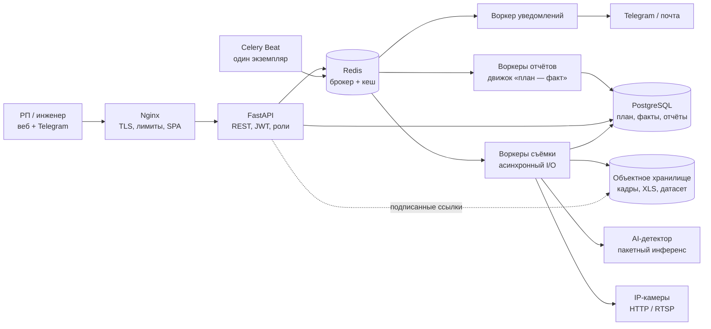
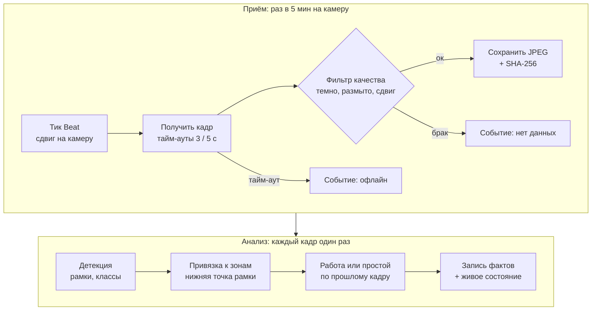
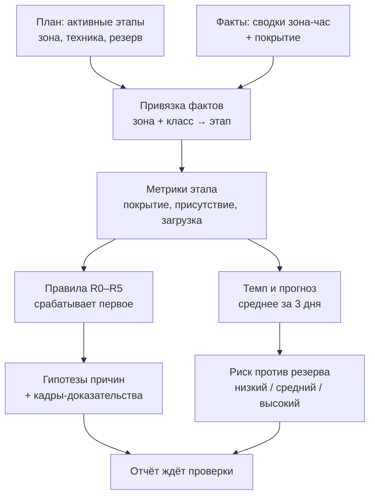

# Контроль хода строительства — архитектура системы

Sep 26, 2026 · @Gary

Система превращает снимки с камер (раз в 5 минут) в ежедневный отчёт «план — факт» по этапам графика. Инженер подтверждает каждое отклонение, и только после этого руководитель проекта (РП) получает уведомление. Главное изменение к [UML](https://garyanikin.github.io/oko-landing/UML-CONSTRUCTION-MONITORING.svg) — каждый кадр распознаётся один раз: нагрузка на детектор падает в 12 раз.

## 1. Задача и допущения

Демо охватывает один объект, 6 камер, 7 классов техники и 7 этапов графика; архитектура рассчитана на 500 объектов и 4 000 камер. Сценарии из UML:

- **Создание проекта** — РП загружает график в XLS, добавляет камеры и рисует зоны на кадре камеры.
- **Наблюдение** — каждые 5 минут с камеры берётся кадр; техника распознаётся, считается по зонам и делится на работающую и простаивающую.
- **Сравнение с планом** — после смены факт привязывается к этапам графика; для отклонений строятся гипотеза причины, прогноз и риск.
- **Проверка** — инженер подтверждает отклонение, отмечает форс-мажор или исправляет ошибку распознавания.
- **Реакция** — РП получает уведомление о подтверждённых отклонениях с высоким риском и видит план и факт на диаграмме Ганта.

Вне рамок хакатона: объёмы работ (этажи, кубометры), охрана труда, расчёты с подрядчиками.

| Допущение | Значение |
| --- | --- |
| Камеры | Стационарные, уличные, 1080p; HTTP-снимок или RTSP. Зоны — постоянные полигоны на кадре |
| Частота | 1 кадр с камеры раз в 5 минут: 12 кадров покрывают часовое окно из UML |
| Классы техники | Экскаватор, самосвал, бульдозер, автобетоносмеситель, автобетононасос, автокран, башенный кран |
| График XLS | Этап, вид работ, зона, начало, окончание; по желанию — потребность в технике, предшественники, резерв |
| Смена | Своя у проекта, например 08:00–20:00 по местному времени; ночные кадры не дают статус «работы не ведутся» |
| Задержки | Живое состояние — не старше 10 мин; отчёт — не позже 30 мин после конца смены; уведомление РП — не позже 5 мин после утверждения |
| Детектор | Ваша модель; до замеров — 150 мс на кадр на 4 vCPU |

## 2. Архитектура

Один код обслуживает API и все воркеры Celery — это модульный монолит. Отдельный сервис только у AI-детектора: ему нужны другое железо и зависимости.



Сплошные стрелки — вызовы и запись. Пунктир: браузер берёт снимки прямо из хранилища по подписанным ссылкам, байты изображений не идут через приложение.

| Компонент | Технологии | Задача |
| --- | --- | --- |
| Nginx | nginx | TLS, лимит размера XLS, ограничение частоты запросов, раздача SPA |
| API | FastAPI, SQLAlchemy, Alembic | REST, разбор XLS, проверка отчётов, дашборд |
| Celery Beat | Celery, строго один экземпляр (второй задвоит задачи) | Съёмка со сдвигом по камерам, отчёт в конце смены, раннее предупреждение в 11:00 |
| Воркеры Celery | Очереди `capture`, `reports`, `notify`, `backfill` | Съёмка и распознавание, движок «план — факт», уведомления с дедупликацией, догон после сбоев |
| AI-детектор | Ваша модель; ONNX Runtime на CPU или TensorRT на GPU | Рамки и классы техники; без состояния, пакетная обработка |
| Redis | Redis | Брокер Celery, живое состояние объекта, кеш дашборда |
| PostgreSQL | PostgreSQL, партиции по дням | План, факты, отчёты, вердикты, журнал аудита |
| Объектное хранилище | S3 API: MinIO локально, Yandex Object Storage в облаке | Кадры, исходные XLS, кадры-доказательства, датасет для дообучения; в базе только ключи |

Раздельные очереди не дают накопившимся отчётам задержать съёмку.

## 3. Главные изменения к UML

Пять сценариев UML сохраняются. Семь изменений закрывают то, что сломает живое демо или помешает масштабированию; они упорядочены по эффекту.

| # | Проблема в UML | Решение | Эффект |
| --- | --- | --- | --- |
| 1 | `POST /detect` каждый цикл заново отправляет 12 последних кадров: каждый кадр распознаётся 12 раз | Распознавать кадр один раз и хранить рамки; работу или простой определять по сохранённым рамкам прошлых кадров | Инференса в 12 раз меньше: 16 vCPU вместо 192 на 4 000 камер |
| 2 | Одна задача `capture_frames` обходит все камеры: зависшая камера задерживает остальные | Своя задача на камеру, тайм-ауты 3 с на подключение и 5 с на чтение, сдвиг старта в пределах 5 минут, circuit breaker | Цикл не растёт с числом камер, нет пиков нагрузки |
| 3 | «Нет данных» — только для офлайн-камер; ночь, туман, засветка или повёрнутая камера читаются как «техники нет» | Фильтр качества кадра и календарь смен; правила оценивают только покрытое время | Нет ложных «работы не ведутся» ночью и в туман |
| 4 | Пересекающиеся камеры считают один экскаватор дважды; камера привязана к одной зоне | Полигоны зон на кадре; машина относится к зоне по нижней точке рамки; по зоне берётся максимум по камерам, а не сумма | Верный счёт на объектах с несколькими камерами |
| 5 | Вердикт «ложное срабатывание» исправляет факт, но статус, темп и риск остаются посчитанными по ошибочным данным | Пересчёт отчёта по исправленным фактам до утверждения | РП не видит риск, построенный на отклонённых данных |
| 6 | Новый XLS снова запускает сценарий 1: дубль проекта, потеря истории | `POST /projects/{id}/schedules` добавляет версию графика; первая остаётся базовой | Изменения плана прослеживаются |
| 7 | Повтор задачи после падения воркера дублирует детекции и отчёты | Ключи идемпотентности `(camera_id, slot_ts)` и `(project_id, report_date)`, upsert, `acks_late` | Доставка «хотя бы один раз» без дублей |

## 4. Конвейер кадров

Каждая камера работает в своём 5-минутном цикле со своим сдвигом. Кадр распознаётся один раз и превращается в число присутствующих и работающих машин по зонам.



Обе ветки событий означают «нет данных», а не «техники нет».

| Шаг | Правило |
| --- | --- |
| Расписание | Beat ставит `capture_one(camera_id, slot_ts)` со сдвигом `hash(camera_id) mod 300` с: 4 000 запросов идут равномерно, без пика раз в 5 минут |
| Получение | HTTP-снимок или один кадр RTSP через ffmpeg; после 3 сбоев подряд камера опрашивается реже, вплоть до раза в 30 мин |
| Время кадра | Часы сервера, округлённые до 5-минутного слота; слот — ещё и ключ идемпотентности |
| Фильтр качества | Средняя яркость, дисперсия лапласиана (размытие, туман), сверка с эталонным кадром камеры (поворот) |
| Детекция | Один кадр на запрос, сервис собирает пакеты до 16 кадров или 50 мс; если детектор недоступен, кадры ждут в статусе `pending_detection`, а очередь `backfill` их догоняет |
| Работа или простой | Рамки сопоставляются с прошлым кадром по IoU ≥ 0,3; машина работает, если сдвинулась больше чем на 15 % ширины рамки или внутри рамки есть изменение выше порога класса |

Машино-часы считаются без трекинга: каждый слот добавляет «число машин × 5 мин». Два экскаватора в 12 слотах дают 2 маш.-ч; рабочие часы считаются так же по числу работающих машин.

| Класс техники | Признак «работает» | Подвох |
| --- | --- | --- |
| Экскаватор | Изменилось положение стрелы или ковша внутри рамки | Копает, стоя на месте |
| Самосвал | Переместился, въехал в зону или выехал из неё | Ожидание в очереди — простой |
| Бульдозер | Переместился | Короткие проходы могут выпасть между кадрами |
| Автобетоносмеситель | Стоит у насоса или точки выгрузки | Вращение барабана не видно при шаге 5 минут |
| Автобетононасос | Стрела разложена: пропорции рамки заметно отличаются от сложенного положения | Во время подачи стрела неподвижна |
| Автокран | Стрела поднята или внутри рамки есть изменение | Установка на выносные опоры считается присутствием |
| Башенный кран | Угол стрелы изменился между кадрами | Всегда на объекте: само присутствие ничего не значит |

## 5. Движок «план — факт»

Движок — чистая функция от плана, фактов и версии правил, поэтому каждый статус объясняется цифрами. Это и есть понятный механизм выявления отклонений, которого требует задание.



**Привязка.** Машино-часы в зоне достаются активному этапу этой зоны, которому нужен этот класс техники; если таких этапов два, часы делятся пропорционально плану. Башенный кран обслуживает весь объект и засчитывается каждому этапу, которому нужен. Техника в зоне ещё не начатого этапа — признак раннего старта, а техника, не нужная ни одному этапу, помечается как «вне графика».

**Метрики этапа за смену.** Покрытие `c` — доля слотов смены с годным кадром зоны этапа. Присутствие ρ сравнивает наблюдаемые машино-часы (МЧ) с планом только за покрытую часть смены; загрузка `u` — доля рабочих часов в присутствии.

```latex
\rho = \frac{\text{МЧ}_{\text{присутствие}}}{\text{МЧ}_{\text{план}} \cdot c} \qquad u = \frac{\text{МЧ}_{\text{работа}}}{\text{МЧ}_{\text{присутствие}}}
```

| Правило | Условие (этап, смена) | Статус | Первые гипотезы причин |
| --- | --- | --- | --- |
| R0 | Покрытие < 60 % | Нет данных | Камера офлайн, темно или камера повёрнута; уходит в поддержку, а не РП |
| R1 | Этап активен, ρ < 0,1 | Работы не ведутся | Погода, нет фронта работ или допуска, подрядчик не вышел |
| R2 | ρ < 0,7 | Недостаток ресурсов | Подрядчик недоукомплектован, техника переброшена на другой объект |
| R3 | u < 0,5 | Простой техники | Неполный комплект (экскаватор без самосвалов), задержка поставок, поломка |
| R4 | Есть техника этапа, который ещё не начался | Опережение / вне графика | Ранний старт или работа, которой нет в графике |
| R5 | Иначе | По графику | Не нужны |

Правила проверяются по порядку, срабатывает первое подходящее. Пороги задаются на проект и сохраняются в отчёте как `rules_version`, поэтому старые отчёты воспроизводимы. Погода из API усиливает гипотезу форс-мажора; к каждому отклонению прикладываются 1–3 кадра-доказательства.

**Темп, прогноз, риск.** Рабочие машино-часы заменяют освоенный объём: из них считаются индекс выполнения графика (SPI) и прогноз окончания по темпу `r` — среднему за последние 3 дня.

```latex
\text{SPI} = \frac{\sum \text{МЧ}_{\text{работа}}}{\sum \text{МЧ}_{\text{план}}} \qquad \text{сдвиг} = \frac{\text{МЧ}_{\text{всего}} - \sum \text{МЧ}_{\text{работа}}}{r} - d_{\text{осталось}}
```

Риск **низкий**, если сдвиг ≤ 0; **средний**, если сдвиг укладывается в полный резерв этапа; **высокий**, если превышает резерв или этап без резерва 2 смены подряд стоит без работ. Резерв берётся из XLS или считается по предшественникам.

**Пример (уведомление из UML).** Бетонирование фундаментной плиты: 2 автобетоносмесителя и 1 насос по 8 ч — 24 маш.-ч в день, 10 дней, всего 240. На 6-й день по плану 144 маш.-ч, камеры увидели 114 рабочих: SPI = 0,79. При темпе 18 маш.-ч в день оставшиеся 126 займут 7 дней вместо 4 — сдвиг +3 дня при резерве 1 день, риск высокий.

Карточка отклонения показывает расчёт: «план 24 маш.-ч, факт 9,5 маш.-ч, покрытие 92 % → ρ = 0,43 → R2 Недостаток ресурсов». Машино-часы измеряют усилия, а не построенный объём; этот разрыв пока закрывает проверка инженера.

## 6. Проверка и уведомления

Вердикт инженера — шлюз между AI и РП: проверка занимает минуты, а каждое исправление попадает в обучение модели.

- **Создание проекта** — XLS разбирается гибко: синонимы заголовков («Наименование работ», «Захватка», «Начало»), объединённые ячейки, даты Excel. Перед сохранением — предпросмотр колонок; недостающая потребность в технике берётся из справочника, РП её подтверждает.
- **Камеры и зоны** — все URL проверяются параллельно с тайм-аутом 3 с. Зоны рисуются на первом кадре камеры, он же эталон для контроля её сдвига. Учётные данные камер шифруются и не отдаются через API.
- **Вердикт по каждому отклонению** — задержка подтверждена; форс-мажор с типом (погода, поломка, поставки); ошибка распознавания с исправленным счётом. В Telegram у инженера кнопки «Подтвердить», «Форс-мажор», «Открыть отчёт»; исправления вносятся в веб-интерфейсе. Инженер может добавить отклонение, которое пропустил AI.
- **Статусы отчёта** — ждёт проверки → на проверке → пересчёт после исправлений → утверждён. Через 4 ч без проверки инженеру приходит напоминание, а высокий риск уходит РП с пометкой «не проверено».
- **Обучение** — исправленные кадры и рамки попадают в `ml-feedback-dataset/{model_version}/`, и каждая проверка улучшает следующую версию модели.
- **Надёжность** — отчёт несёт версию: устаревшая правка получает HTTP 409, а не перезаписывает вердикты коллеги. Все действия пишутся в журнал `review_log` только на добавление (кто, что, до, после) — это важно для претензий к подрядчику.
- **Раннее предупреждение** — в 11:00 движок проверяет утренние факты. Этап без техники с начала смены — сигнал инженеру в тот же день, а не на следующий.
- **Одно уведомление на проблему** — отклонения собираются в проблему по паре «этап, правило». РП получает сообщение при её открытии, росте риска и закрытии: этап, сдвиг против резерва, причина, риск, кадр и ссылка.
- **Дашборд** — диаграмма Ганта с плановыми и фактическими полосами, линией «сегодня» и маркером прогноза окончания, живые кадры с рамками. Кеш `dashboard:{project_id}` на 300 с сбрасывается при утверждении отчёта.

## 7. Данные и API

PostgreSQL хранит 20 таблиц; быстро растут только `frames` и `detections`, поэтому только они разбиты на партиции по дням. Движок читает компактную почасовую сводку `zone_hourly`.

| Таблица | Ключевые поля | Зачем |
| --- | --- | --- |
| `schedule_tasks` | schedule\_version\_id, name, work\_type, zone\_id, start\_date, end\_date, total\_float\_days | Этапы из XLS; версии графика — в `schedule_versions` |
| `task_requirements` | task\_id, machine\_class, count, hours\_per\_shift | Плановые машино-часы |
| `camera_zones` | camera\_id, zone\_id, polygon | Полигоны зон в координатах кадра |
| `frames` | PK (camera\_id, slot\_ts), s3\_key, sha256, quality, model\_version, boxes | Кадр и его рамки; партиции по дням, хранение 90 дней |
| `detections` | camera\_id, slot\_ts, zone\_id, machine\_class, count, active\_count | Счёт по зонам: таблица из UML с ключом по слоту |
| `zone_hourly` | zone\_id, hour, machine\_class, present\_mh, working\_mh, coverage | Сводка для движка; хранится весь срок проекта |
| `reports` | UNIQUE (project\_id, report\_date), rules\_version, model\_version, status, version | Один отчёт на день, идемпотентно |
| `deviations` | report\_id, task\_id, rule, metrics, hypotheses, evidence\_frames, verdict | Отклонение и вердикт инженера |

Остальные: `projects`, `zones`, `cameras`, `work_type_machinery` (справочник из UML), `camera_events` (объясняет каждое «нет данных»), `stage_status`, `issues` (дедупликация уведомлений), `incidents` (форс-мажор), `review_log` (аудит), `users`, `project_members`.

| Метод и путь | Назначение |
| --- | --- |
| `POST /api/v1/projects` | Создать проект: XLS, камеры, зоны; ответ 201 со статусом каждой камеры |
| `POST /api/v1/projects/{id}/schedules` | Загрузить новую версию графика; первая остаётся базовой |
| `GET /api/v1/projects/{id}/live` | Живые счётчики и последние кадры из Redis |
| `GET /api/v1/projects/{id}/dashboard` | Гант «план — факт», проблемы, KPI; кеш 300 с |
| `GET /api/v1/reports/{id}` | Статусы этапов, отклонения, подписанные ссылки на кадры (1 ч) |
| `POST /api/v1/reports/{id}/review` | Вердикты по отклонениям; передаёт `version`, при устаревшей — 409 |
| `POST /internal/detect` | AI-детектор: один кадр на вызов, пакеты собираются внутри сервиса |

Контракт детектора согласуйте первым — тогда ML, бэкенд и фронтенд работают параллельно:

```json
{
  "frame_id": "cam-07/2026-10-02T09:35:00Z",
  "model_version": "machines-v3.2",
  "boxes": [
    {"cls": "excavator", "conf": 0.91, "xyxy": [412, 288, 655, 470]},
    {"cls": "dump_truck", "conf": 0.84, "xyxy": [700, 310, 902, 455]}
  ]
}
```

## 8. Нагрузка и масштабирование

На 4 000 камер система принимает 13,3 кадра/с и 461 ГБ снимков в сутки. Инференс укладывается в 16 vCPU, потому что каждый кадр распознаётся один раз.

| Показатель | Демо: 1 объект, 6 камер | Масштаб: 500 объектов, 4 000 камер |
| --- | --- | --- |
| Кадров в секунду | 0,02 | 13,3 |
| Кадров в сутки | 1 728 | 1 152 000 |
| Снимков в сутки | 0,69 ГБ | 461 ГБ |
| Горячее хранение за 30 дней | 21 ГБ | 13,8 ТБ |
| Детектор, кадр один раз | 4 vCPU | 16 vCPU (по UML — 192) |
| Строк детекций в сутки | 5 184 | 3,46 млн (40 в секунду) |

Допущения: JPEG 400 КБ, 3 строки детекций на кадр, 150 мс на кадр на воркере с 4 vCPU при загрузке не выше 50 %.

- **Узкие места по порядку** — опрос камер, хранение снимков, брокер. Запись примерно в 60 раз интенсивнее чтения (13,3 кадра/с против 0,23 запроса дашборда/с), поэтому усилия идут в конвейер приёма, а чтение закрывает простой кеш.
- **Камеры и хранение** — асинхронные воркеры с сотнями параллельных запросов; для объектов без публичного IP — edge-агент, который сам отправляет кадры по HTTPS. Снимки хранятся 30 дней в полном разрешении, затем год в холодном классе и удаляются; партиции `frames` и `detections` удаляются через 90 дней, сводки остаются.
- **Детектор и очереди** — реплики без состояния за балансировщиком, динамические пакеты, GPU после 70 % загрузки CPU. После сбоя, пока очередь длиннее лимита, обрабатывается каждый второй слот. Брокер на масштабе — RabbitMQ с `acks_late`.
- **Доступность и согласованность** — приём выбирает доступность: кадры копятся в хранилище, пока детектор недоступен, и распознаются позже. Проверка отчётов выбирает согласованность: одна основная база и оптимистическая блокировка.
- **Безопасность и персональные данные** — короткоживущий JWT, роли на проект, шифрование учётных данных камер, приватный бакет с подписанными ссылками. Люди в кадре размываются до сохранения, данные хранятся в российском регионе (152-ФЗ).
- **Мониторинг** — Prometheus и Grafana: доля успешных снимков по камерам, возраст кадра, длина очередей, p95 детектора, пульс Beat. Если счёт класса падает сразу на всех камерах, это сбой модели или конвейера, а не проблема объекта.

## 9. Демо и экономика

**Сценарий демо (6 минут)**

1. **0:00** — Проблема одной фразой: инженеры смотрят камеры вручную и сверяют их с графиком в голове.
2. **0:30** — Загружаем XLS: предпросмотр показывает 7 этапов и потребность в технике.
3. **1:00** — Добавляем 6 камер-симуляторов и вживую рисуем полигон зоны.
4. **1:30** — «Прогон смены»: 144 слота за 2,4 минуты. CAM-3 темнеет в 14:00 и показывает «нет данных», а не «работы не ведутся».
5. **4:00** — Смена закончилась, у инженера звонит телефон. Подтверждаем задержку, отмечаем дождь как форс-мажор, отклоняем ложную детекцию; отчёт пересчитывается.
6. **5:00** — Приходит уведомление РП: «Фундаментная плита: сдвиг +3 дня при резерве 1 день, высокий риск». Открываем дашборд на маркере прогноза.
7. **5:40** — Финал: масштаб (4 000 камер на 16 vCPU инференса) и обучение на каждой проверке.

[Интерактивное демо](https://garyanikin.github.io/oko-landing/plan-fact-site-monitor.html)

**Сценарный день.** Вырезки техники накладываются на постоянный фон каждой камеры, и детектор видит реалистичные повторяемые кадры. Запасной вариант — заранее посчитанные детекции, последний — запись экрана.

| Время | Событие | Ожидаемый результат |
| --- | --- | --- |
| 08:00–20:00 | Фундаментная плита: 1 автобетоносмеситель вместо 2, насос с 09:00 | R2 недостаток ресурсов; сдвиг +3 дня при резерве 1 день — высокий риск |
| 08:00–17:00 | Подъездная дорога: бульдозер и самосвал работают | R5 по графику |
| 08:00–15:30 | CAM-5 на ливневой канализации офлайн | R0 нет данных (покрытие 38 %), уходит в поддержку |
| 10:30–16:30 | Дождь, техника в котловане 2 стоит | R3 простой техники; инженер отмечает форс-мажор (погода) |
| 11:00 | Зона обратной засыпки пуста с 08:00 | Раннее предупреждение, затем R1 работы не ведутся |
| 14:00–15:00 | Кадры CAM-3 слишком тёмные | Исключены из фактов; покрытие 92 %, ложной тревоги нет |
| 16:00 | Манипулятор распознан как автокран (0,64) в секции 3, где этап начнётся через неделю | R4 опережение / вне графика; отклонено как ошибка распознавания |

**Что строим за 48 часов.** Разбор XLS с предпросмотром, симулятор камер, конвейер с детекцией, движок (по юнит-тесту на правило), проверку в Telegram и дашборд. Заглушки: авторизация (два пользователя — РП и инженер), MinIO вместо облачного хранилища, записанный ответ погоды. Edge-агент, оценка объёмов и дообучение — в дорожную карту, один слайд.

**Экономика на один объект.** Эффект — 351 тыс. ₽ в месяц против 40 тыс. ₽ затрат, в 8,8 раза больше; в пессимистичном сценарии — 111 тыс. ₽, в 2,8 раза. Он складывается из времени инженера (49,5 тыс. ₽), неподтверждённых машино-часов (135 тыс. ₽) и сокращения задержек (167 тыс. ₽).

Система окупается уже при одном из трёх условий: 1,2 ч сэкономленного времени инженера в день, 0,9 % выявленных неподтверждённых машино-часов или полдня предотвращённой задержки в год. Цифры условные, в расчёт подставляются данные заказчика: [презентация по экономике](https://garyanikin.github.io/oko-landing/%D0%AD%D0%BA%D0%BE%D0%BD%D0%BE%D0%BC%D0%B8%D0%BA%D0%B0%20%D0%BA%D0%BE%D0%BD%D1%82%D1%80%D0%BE%D0%BB%D1%8F%20%D1%81%D1%82%D1%80%D0%BE%D0%B9%D0%BA%D0%B8%20%D0%BF%D0%BE%20%D0%BA%D0%B0%D0%BC%D0%B5%D1%80%D0%B0%D0%BC.pdf), [калькулятор окупаемости](https://garyanikin.github.io/oko-landing/%D0%BE%D0%BA%D1%83%D0%BF%D0%B0%D0%B5%D0%BC%D0%BE%D1%81%D1%82%D1%8C-%D0%BA%D0%BE%D0%BD%D1%82%D1%80%D0%BE%D0%BB%D1%8F-%D1%81%D1%82%D1%80%D0%BE%D0%B9%D0%BA%D0%B8.html).

**Цифры для слайда**

- mAP@0,5 по классам на отложенных кадрах демо-камер.
- Ошибка счёта: средняя абсолютная ошибка числа машин по зоне на кадр.
- Сценарный день: каждое событие даёт ожидаемый статус, ложных тревог ноль.
- Задержки: от кадра до живой плитки и от конца смены до отчёта.
- Время инженера «до» — спросить у эксперта организаторов, а не выдумывать.

**Дополнительно**

| Вопрос | Ответ |
| --- | --- |
| Машино-часы — это не прогресс. | Согласны, это усилия. Разрыв закрывает вердикт инженера; оценка объёмов (этажи, кубометры) — следующий шаг. |
| Как отличить работу от простоя? | Признаки по классам техники (раздел 4), уточняются исправлениями инженера. |
| Ночь, туман, снег? | Фильтр качества и календарь смен: «нет данных», а не «работы не ведутся». |
| Насколько это точно? | Показываем метрики. РП видит отклонения после проверки инженером, а непроверенные через 4 ч приходят с пометкой «не проверено». |
| Это масштабируется? | 4 000 камер: 13,3 кадра/с, 16 vCPU на инференс, один PostgreSQL. |
| Окупится ли? | В базовом сценарии эффект в 8,8 раза больше затрат, в пессимистичном — в 2,8 раза. |

## Источники

- [The System Design Primer](https://github.com/donnemartin/system-design-primer) — метод в четыре шага, по которому построен документ, и большинство паттернов масштабирования из раздела 8.
- Исходные материалы: диаграмма последовательности `UML-CONSTRUCTION-MONITORING.puml` и описание задачи хакатона.
